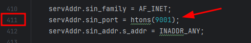

### DarkSpecter

- Atención: No me hago cargo ni responsable del uso que se le puede dar a este repositorio!
- Recuerda: Está hecho para fines educativos y de aprendizaje.

En desarollo...

# Requirements:
  - Compilador GCC (preferiblemente de 64Bits) [DOWNLOAD LINK](https://github.com/brechtsanders/winlibs_mingw/releases/download/13.2.0mcf-16.0.6-11.0.1-ucrt-r2/winlibs-x86_64-mcf-seh-gcc-13.2.0-llvm-16.0.6-mingw-w64ucrt-11.0.1-r2.7z)
  - Linux: `# apt install buildessential`  

# Preparation Linux

1. Modifica el archivo **client.c** para especificar la dirección IP y el puerto de destino y si es necesario el del servidor:
   1. Cliente:

      

   2. Server:

      

2.  Compilamos:

    - Cliente:
        `gcc linux/client.c -o linux/client`
    - Server:
        `gcc linux/client.c -o linux/client`

3. Ejecutamos:

- Server:

    

# Preparation Windows

1. Modificamos el archivo **client.c** especificando la IP de atacante y el puerto especificado en **server.c**

    

2. Compilamos:

    - Cliente:
      ` gcc -mwindows .\client.c -o .\dist\clientwindows -lws2_32 -lShlwapi`

    - Server:
      `gcc .\server.c -o .\dist\server -lws2_32 -lShlwapi`

3. Ejecutamos:

- Server:

  

# Aviable Commands
Por el momento tenemos disponible los siguientes comandos:

    - help            -> Show help message
    - shell           -> Enter shell mode ("q" for exit)
    - exec            -> Execute command without shell mode
    - download <file> -> Download file from target
    - sysinfo         -> Show system info (better on linux)
    - lowpersistence  -> Set persistence (no root)
    - q / exit        -> Exit server
    - q -y / exit -y  -> Exit server and client (close binary) 
